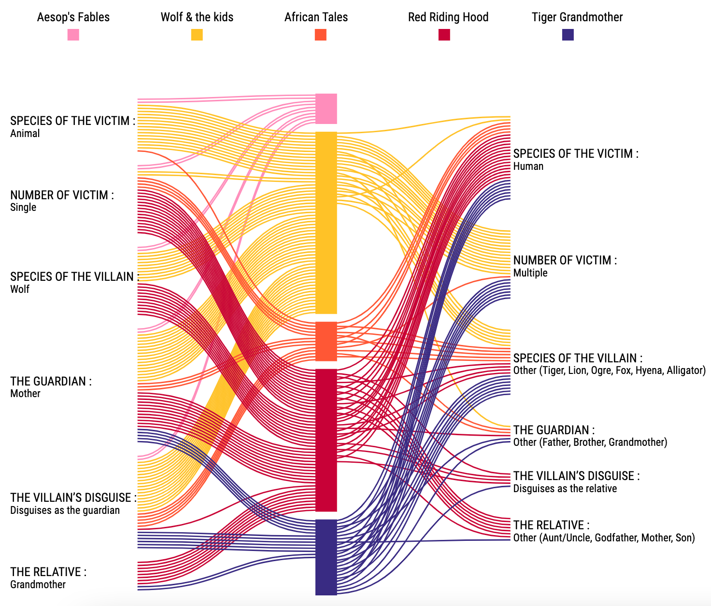

# Folklore - Red Riding Hood

Visualizing how Red Riding Hood stories evolved based on the paper - [The Phylogeny of Little Red Riding Hood](https://journals.plos.org/plosone/article?id=10.1371/journal.pone.0078871) by Dr. Jamshid J. Tehrani.

- D3 Path
- D3 Sankey
- Scrollytelling

## Visualization

Here, I'm visualizing the time line of various folklores that travelled through Europe and Asia since the first century to form what we know today as the Red Riding Hood tales. Also visualized, is how each story differ or resemble in terms of number of characters, species of the characters, and other such story elements.

## A Snippet of the scrolly section

https://user-images.githubusercontent.com/38870742/167746975-06472078-c5ea-4b7f-8efd-58982242d4a8.mov

## Data

Data collated from the [paper](https://journals.plos.org/plosone/article?id=10.1371/journal.pone.0078871)

## Scrolling Section
- Code for scrolling section referred from [here](https://github.com/vlandham/scroll_demo)
- Inspiration and reference from [Measles Outbreak Visualization by Adam Pearce (Bloomberg)](https://www.bloomberg.com/graphics/2015-measles-outbreaks/)

## Sankey
Code for sankey chart referred from [here](https://github.com/d3/d3-sankey)

### Text Wrapping
Reference for text wrapping from [here](https://bl.ocks.org/mbostock/7555321)
